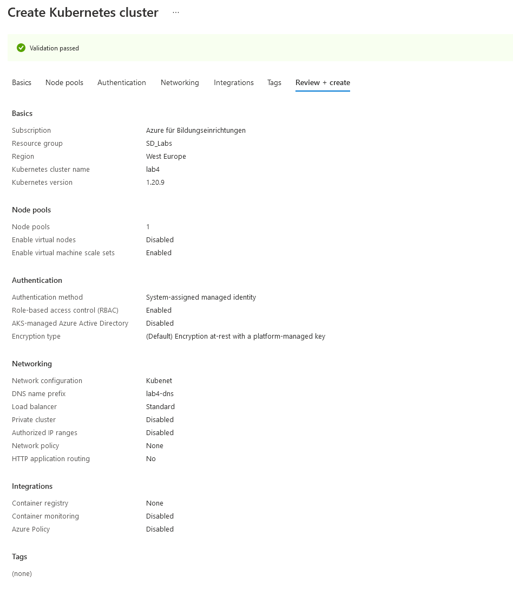
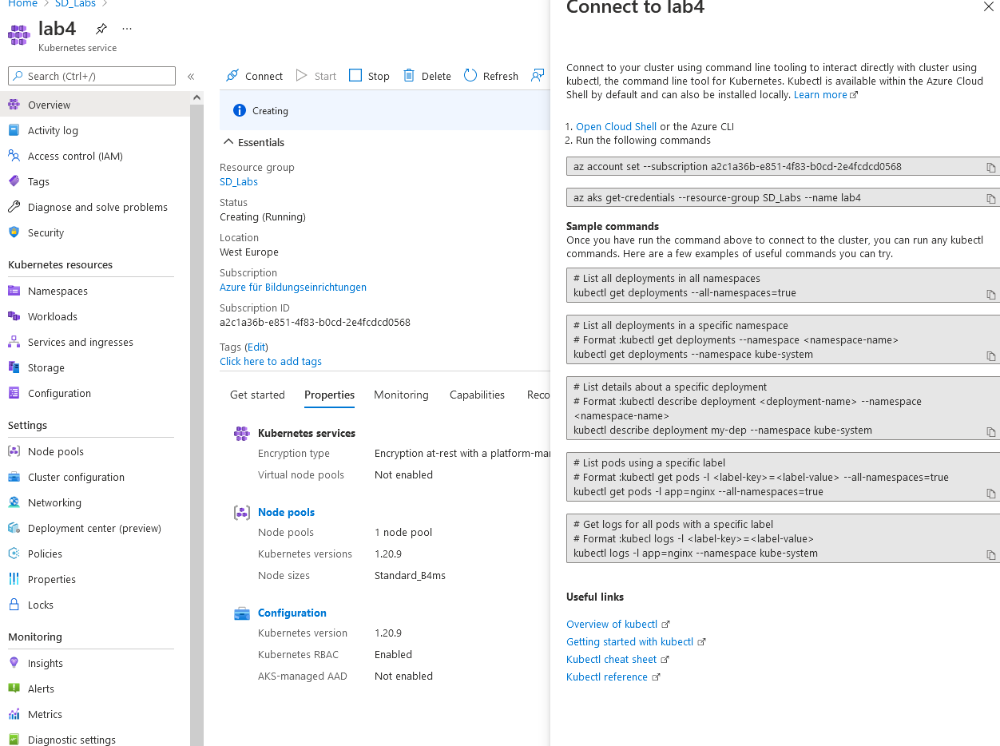
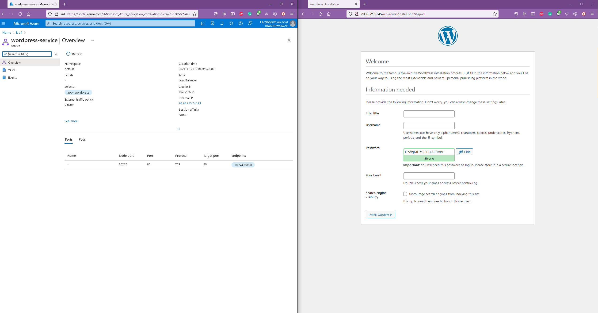
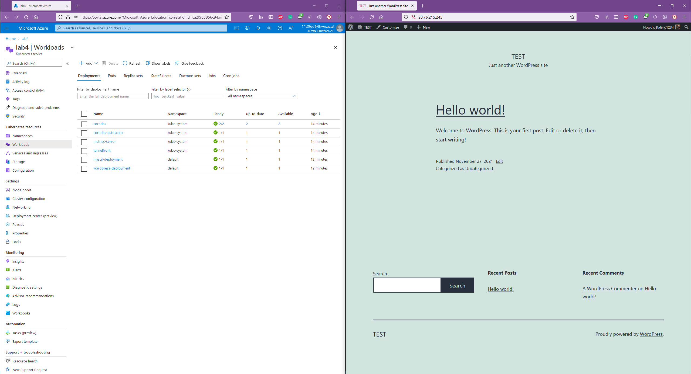

# Links
https://docs.docker.com/engine/reference/commandline/push/
https://www.youtube.com/watch?v=s_o8dwzRlu4&t
https://kubernetes.io/docs/concepts/configuration/secret/#using-secrets-as-environment-variables
https://kubernetes.io/docs/concepts/workloads/controllers/deployment/
https://kubernetes.io/docs/concepts/configuration/configmap/
https://kubernetes.io/docs/concepts/configuration/secret/
https://minikube.sigs.k8s.io/docs/handbook/accessing/
https://kubernetes.io/docs/tutorials/stateful-application/mysql-wordpress-persistent-volume/
https://stackoverflow.com/questions/41604499/my-kubernetes-pods-keep-crashing-with-crashloopbackoff-but-i-cant-find-any-lo
https://wordpress.org/support/article/debugging-in-wordpress/
https://kubernetes.io/docs/tasks/inject-data-application/define-command-argument-container/
https://kubernetes.io/docs/tasks/debug-application-cluster/get-shell-running-container/
https://docs.microsoft.com/en-us/azure/aks/kubernetes-walkthrough

# Process
Here first I built my dockerfiles and pushed my images to DockerHub.
```console
docker build -t istvan1997/mysql:latest .
docker push istvan1997/mysql:latest
docker build -t istvan1997/wordpress:latest .
docker push istvan1997/wordpress:latest
```
After doing so I modified the compose file from Lab3/Teil1 to test the images.
It worked, I hope nothing was cached that could influence its future behaviour...

Afterwards I watched the video (https://www.youtube.com/watch?v=s_o8dwzRlu4&t), installing minikube in the process for later. 
I used the follwing command to do this:
```console
winget install minikube
```
Weirdly, minikubes directory was added to the Path environment variable inside the Systemvariables, but not to the user specific variable, so I had to go in and do it manually...
I needed to define my encode my secret values in Base64, for which I used this website: https://www.base64encode.org/
After that I just followed the tutorial and adjusted things to fit the assignment.
Soon I needed to use the following commands, in order, to actually get my Kubernetes cluseter up and running.
```console
kubectl apply -f mysql-secret.yaml
kubectl apply -f wordpress-secret.yaml
kubectl apply -f mysql.yaml
kubectl apply -f wordpress-config.yaml
kubectl apply -f wordpress.yaml
kubectl get all # These I ran to check whether everything went fine or not.
kubectl get configMap
kubectl get secret
```
Afterwards I encountered two problems. First I could not connect to my minikube client. This was not that hard to solve: https://minikube.sigs.k8s.io/docs/handbook/accessing/
The following commna was needed to find the real IP of the wordpress client.
```console 
minikube service --url wordpress-service
```
As for the second one, I gave the same host to wordpress as I did in the compose file, ups...
After making sure that it worked, I was about to get to work on pushing it to Azure, when I thought, I should give this volumes. Then I found this: https://kubernetes.io/docs/tutorials/stateful-application/mysql-wordpress-persistent-volume/
**Internal Screaming**
After adjusting my yaml files to be similar to the ones in the example above, I encountered a problem. Namely, the pods did not want to work. I figured out quickly that I did not have enough space for the volumes... So I adjusted the numbers a bit, and after waiting a bit, they worked again.
The next problem was, the wordpress files were gone. After a bit of research it turns out kubernetes overwrites them for the volume. So after a bit more research I decided that, you know what, WordPress should be stateless, and thus removed its volume. After that, I also gave up on the volumes for mysql. ~~It just kept on crashing for no apparent reason.~~ After going into the cli (**kubectl exec --stdin --tty shell-demo -- /bin/bash**), checking the logs using **kubectl logs mypod -p**. I realized, it had the same problem as wordpress. So I just decided to leave everything stateless. The tutorial said, that normally one does not mess around with states here anyways.
Finally, I manually done everything else on Azure, following your steps.
Albeit I had to play around a bit, as my subscription did not allow for more than 6 virtual cores among other things.
See image below for the final settings


After that I added the credentials using the top commands from the image:


Then I pushed my things using the following commands:
```console
kubectl apply -f mysql-secret.yaml
kubectl apply -f wordpress-secret.yaml
kubectl apply -f mysql.yaml
kubectl apply -f wordpress-config.yaml
kubectl apply -f wordpress.yaml
```
Here I noticed that NodePort was the wrong kind of service-type, so I changed it to a LoadBalancer.
After adjusting that I reaplied wordpress **kubectl apply -f wordpress.yaml**.
After that it worked, sometimes. My mysql image was unstable, I managed to connect from time to time but not always, as it would restart every now and then.
See images below for when it worked:



## Composition
My solution consists of the following files:
+ mysql-secret.yaml  
This is the file where the secret values, such as database user + password are stored for the mysql database.

+ mysql.yaml  
This is the deployment + service file for the mysql database.

+ wordpress-secret.yaml  
This is the file where the secret values, such as database user + password are stored, these are needed to access the database.

+ wordpress-config.yaml  
This is the file that stores information that can be visible to others.

+ wordpress.yaml  
This is the deployment + service file for the wordpress app.  

On a side note: secret files are not entirely safe, they only use encrypted data that is based on Base64 and that is it, so in production they would need an extra layer. (according to the tutorial.)

## Critic
I did not think that kubernetes and docker worked so badly together. I mean, while one thing works in Docker in one way, it is not guaranteed to work with kubernetes the same way, such as volumes.